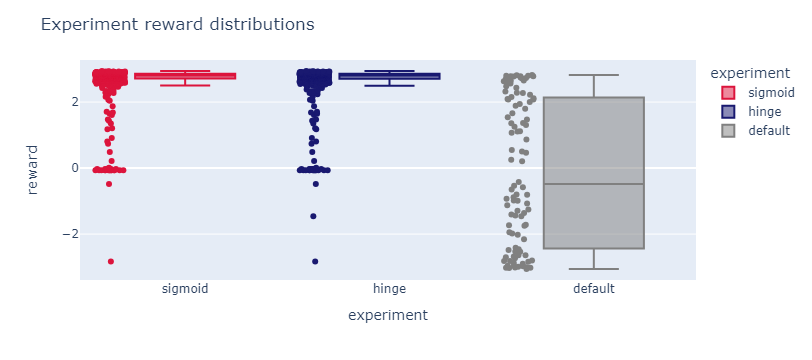
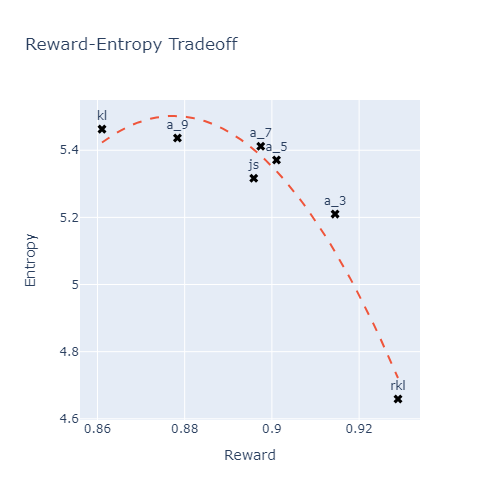
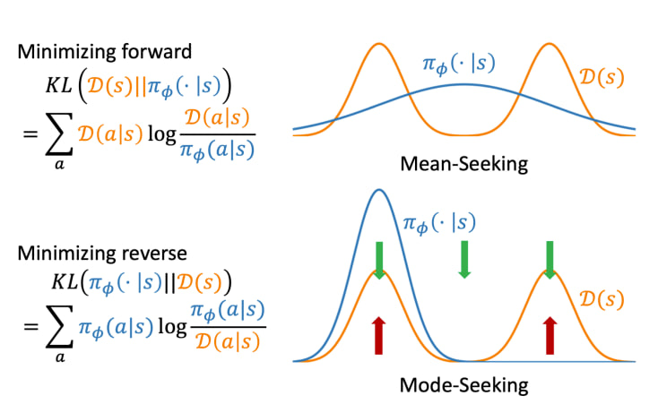
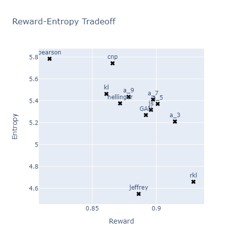

## Report 

This is a report on reproducing the results of the papers [Direct Preference Optimization: Your Language Model is Secretly a Reward Model](https://arxiv.org/pdf/2305.18290.pdf) and [Beyond Reverse KL: Generalizing Direct Preference Optimization with Diverse Divergence Constraints](https://openreview.net/pdf?id=2cRzmWXK9N). This project explores how to constrain a model to generate texts with specific conditions, how to train it using the DPO architecture, how to modify it using other \(f\)-divergences, and evaluates potential improvements. For code details, refer to the notebooks; they are well-documented and can be executed block by block, as all dependencies are included. The notebook list is available at the bottom of the report in the table of contents and via links in the subheadings. Only general descriptions are provided here. \
[Task description](https://scitator.notion.site/e5db49d792f6476a8b3ce19fd91c6655)

### [Level 1. Loss comparison](https://nbviewer.org/github/Lerostre/test-task-alignment/blob/main/1.%20Loss%20comparison.ipynb)

One of the primary tasks at this stage was adapting the model to generate more positive texts (since the original version is trained on both positive and negative reviews, it generates both classes). One proposed solution was inserting keywords into the prompt, which was implemented. The following approaches were considered:
- **Beam Search**: During beam search, it is possible to retain options that are not only more probable but also have positive sentiment. This can be done using a model like gpt2 if a different architecture is used, but it requires rewriting the generation function. This is non-trivial and requires optimization, as generation is already slow.
- **The more the better**: Generating as many examples as possible in hopes of collecting enough positive ones. However, this is not a modification of the generation process itself. Samples for training were ultimately collected this way.
- **(Supervised) fine-tuning**: This idea requires sourcing positive reviews from datasets like IMDB. Again, this approach does not adapt the existing model directly.
- **Prompt Engineering**: The prompt `'This movie is great. {to_generate}'` was selected for this purpose and yields the results shown in the corresponding notebook. There was also an attempt to insert other keywords via bias to encourage the model to generate the desired output.

Following this experiment, a reward was calculated using `"lvwerra/distilbert-imdb"` for each generated text. Texts with a reward \(\geq\) 2.5 were classified as positive (a higher `threshold` resulted in insufficiently detailed positive reviews ending up in `rejected`). Negative texts were those with a reward \(<\) 1.75. Keeping the aforementioned bias makes some texts highly repetitive, so it is better removed. Adding a diversity filter helps resolve this issue, though it significantly increases execution time. 
Training an SFT model with the loss from the paper on a dataset built from winner-loser pairs yields the following results:

$$
\begin{array}{lllc}
\hline \text{experiment } & \text{reward} & \text{diversity } \\
\hline \text {default} & \text{-0.068486} & \text{5.825884} \\
\text {hinge} & \text{ 2.533579} & \text{4.582645} \\
\text {sigmoid} & \text{ 2.538272} & \text{4.583957} \\
\text {best} & \text{ 2.935000} & \text{4.732000} \\
\hline
\end{array}
$$

The reward of the generated texts increased compared to the original SFT policy. Diversity decreased, which is expected since the generation is constrained to positive reviews. Comparing the losses (`hinge` and `sigmoid`) shows that their values are close with no significant difference.
The \(\text{best}\) row represents the distribution from the winners obtained after filtering candidates. This serves as a target distribution.

The final plot is shown below. `DPOTrainer` functions correctly, and the reviews become significantly more positive:

### [Level 2. F-divergences](https://nbviewer.org/github/Lerostre/test-task-alignment/blob/main/2.%20F-divergences.ipynb)

The generalized loss, where \(f'\) is the derivative of an arbitrary divergence, corresponds to the reverse KL divergence in `DPOTrainer`. The code relies on a table of pre-calculated derivatives:

$$
\begin{array}{lllc}
\hline f \text {-divergence } & \boldsymbol{f}(\boldsymbol{u}) & \boldsymbol{f}^{\prime}(\boldsymbol{u}) \\
\hline \alpha \text {-divergence }(\alpha \in(0,1)) & \left(u^{1-\alpha}-(1-\alpha) u-\alpha\right) /(\alpha(\alpha-1)) & \left(1-u^{-\alpha}\right) / \alpha\\
\text { Reverse KL }(\alpha=0) & u \log u & \log u+1\\
\text { Forward KL }(\alpha=1) & -\log u & -1 / u\\
\text { JS-divergence } & u \log u-(u+1) \log ((u+1) / 2) & \log (2 u /(1+u))\\
\hline
\end{array}
$$

The `utils.py` file contains loss functions derived from other divergence functions:
- `RKL_divergence`
- `KL_divergence`
- `alpha_divergence`
- `JS_divergence`
  
Integration logic is located in `pipeline.py`.
The resulting graph differs from the one presented in the paper:

This divergence likely stems from:
- Usage of custom prompts instead of the IMDB dataset prompts used in the paper.
- Initial diversity was already high due to the custom prompts.
- Different training parameters. In the paper, the model was trained to full convergence on a larger number of examples. Here, the number of examples was limited by compute, and the number of epochs was set experimentally due to visible overfitting on the validation set.

The overall trend aligns with the paper. \(\text{KL}\) generates diverse texts, including negative ones, resulting in a lower reward and high entropy. \(\text{RKL}\) behaves differently because it is not zero-forcing.

### [Level 3. Improvements](https://nbviewer.org/github/Lerostre/test-task-alignment/blob/main/3.%20Improvements.ipynb)

The main objective was testing other divergence functions to evaluate their impact on model behavior. \(\text{Total Variation}\) and \(\text{Chi-squared}\) were introduced in the paper but not analyzed in depth.

$$
\begin{array}{lllc}
\hline f \text {-divergence } & \boldsymbol{f}(\boldsymbol{u}) & \boldsymbol{f}^{\prime}(\boldsymbol{u}) \\
\hline
\text { Pearson } \chi^2 & (u-1)^2 & 2(u-1)\\
\text { Neyman } \chi^2 & (1-u)^2 / u & 1 - \frac{1}{u^2}\\
\text { CNP }  \chi^2 & \frac{1}{3} \left(2\chi^2_{\text{Pearson}} + \chi^2_{\text{Neyman}} \right) & \frac{1}{3} \left( 4u - 3 - \frac{1}{u^2}\right)\\
\text { Hellinger } & (\sqrt{u}-1)^2 & 1 - \frac{1}{\sqrt{u}}\\
\text { Jeffrey } & (u-1)\log{u} &  \log u + 1 - \frac{1}{u}\\
\text { GAN } & u\log{u} - (u+1)\log(u+1) & \log u - \log(u+1)\\
\text { Total Variation } & \frac{1}{2}|u-1| & u>1 ? \frac{1}{2}:-\frac{1}{2}\\
\chi^{\alpha} \ \text {distance} \ (\alpha > 1) & \frac{1}{2}|u-1|^{\alpha} & u>1 ? \frac{\alpha(u-1)^{\alpha-1}}{2}:-\frac{\alpha(1-u)^{\alpha-1}}{2}\\
\hline
\end{array}
$$

Predicting the optimal divergence function is difficult due to their complex properties; this phase is exploratory.
Positive results were achieved with \(\text{CNP} \ \chi^2\) — it significantly increases diversity while maintaining the reward level of KL divergence. Details are in the notebook. Attempts to improve quality via `ipo` and `kto` losses showed minimal impact. They might perform better with alternative divergence functions.

### Repository Contents

- [**1. Loss comparison.ipynb**](https://nbviewer.org/github/Lerostre/test-task-alignment/blob/main/1.%20Loss%20comparison.ipynb) - Contains the conditional review generation procedure, `DPOTrainer` training, visual loss comparison via distribution graphs, and prompt analysis. Relates to the analysis of the DPO paper.
- [**2. F-divergences.ipynb**](https://nbviewer.org/github/Lerostre/test-task-alignment/blob/main/2.%20F-divergences.ipynb) - Evaluates the impact of different divergences on the diversity-reward tradeoff. Corresponds to the 'Beyond RKL' paper.
- [**3. Improvements.ipynb**](https://nbviewer.org/github/Lerostre/test-task-alignment/blob/main/3.%20Improvements.ipynb) - Contains attempts to improve the model architecture.
- [**pipeline.py**](https://github.com/Lerostre/test-task-alignment/blob/main/pipeline.py) - General training pipeline: prompt generation, model training, text generation, data aggregation, and storage.
- [**utils.py**](https://github.com/Lerostre/test-task-alignment/blob/main/utils.py) - Utility functions including seed generation and \(f\)-divergences.
- [**trainers.py**](https://github.com/Lerostre/test-task-alignment/blob/main/trainers.py) - Contains a modified `DPOTrainer` for Level 2.
- [**readme.md**](#report) - Current report.
- [**./experiments**](https://github.com/Lerostre/test-task-alignment/tree/main/experiments) - Directory containing generated model outputs (e.g., hinge loss, rkl divergence).
- [**./src**](https://github.com/Lerostre/test-task-alignment/tree/main/src) - Image assets for the report.
- [**./hf_dataset**](https://github.com/Lerostre/test-task-alignment/tree/main/hf_dataset) - Dataset of winner-loser pairs used for training.
